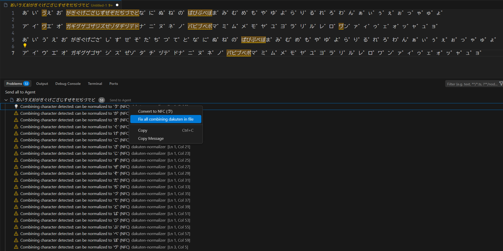

# Dakuten Normalizer

結合文字（濁点 `U+3099` および半濁点 `U+309A`）を検知し、NFC形式に正規化するための VSCode 拡張機能です。

## 主な機能

本拡張機能を導入することで、以下の機能が利用可能になります。

- エディタ上のハイライト: 結合文字 `U+3099` `U+309A` が含まれる箇所をエディタ上でハイライト表示します。
- 警告表示 (Problems): 結合文字が使用されている箇所を Problems パネルに警告として表示します。
- クイックフィックス (Quick Fix): 
  - 個別修正: 該当箇所にカーソルを合わせることで、NFC形式への正規化を提案します。
  - 一括修正: ファイル内のすべての結合文字を一度にNFC形式へ正規化します。

## スクリーンショット



## インストール方法

(後日追記予定: VSIXファイルからのインストール手順、または Marketplace からのインストール手順)

## 開発ビルド

```bash
npm install
npm run compile
```

## ライセンス

MIT License
